# Retail-Sales-Analysis_PracticeSQL
A SQL-based data analysis practice project focused on exploring retail sales data through data cleaning, exploratory data analysis (EDA), and business insights generation. 

## 📊 Project Overview
This project analyzes a retail sales dataset using Microsoft SQL server. The objective is to practice data cleaning, exploratory data analysis (EDA) and business analysis by writing SQL queries that uncover various insights about customers, categories, sales etc.

## 🎯 Objectives
<ol>
  <li>Set up a retail sales database: Create and populate a retail sales database with the provided sales data.</li>
  <li>Data Cleaning - find missing values, NULL and do necessary replacements </li>
  <li>Exploratory data analysis - Perform basic EDA to understand the data better</li>
  <li>Business Analysis - Use SQL to answer specific business questions and derive insights from the sales data.</li>
</ol>

## 📁 Project Structure
### 1. Database and Table setup
   <ul>
     <li>Create database named : p1_retail_db</li>
     <li> A table named dbo.retail_stores is created to store sales data in it. The table structure includes columns for transaction ID, sale date, sale time, customer ID, gender, age, product category, quantity sold, price per unit, cost of goods sold (COGS), and total sale amount.</li>
   </ul>

### Database Schema

<h4>dbo.retail_stores table</h4>
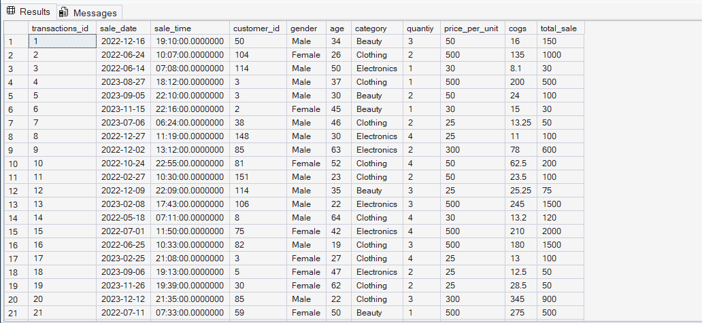

### 2. Data cleaning and EDA

Following data cleaning steps and EDA was performed to prepare the dataset for further analysis:

1. Find total number of records in table  
<b>select COUNT(*) as total_records from dbo.retail_sales;</b>
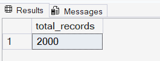
 
2. Find total unique customers 
<b>select COUNT(DISTINCT customer_id) as [Unique Customers] from dbo.retail_sales;</b>
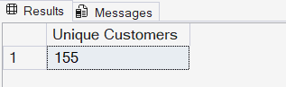
 
3. Identify all unique product categories in the dataset. 
<b>select DISTINCT category from dbo.retail_sales;</b>
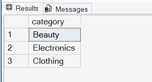
 
4. Check if any column has NULL 
<b>select * from dbo.retail_sales WHERE transactions_id IS NULL OR sale_date IS NULL OR sale_time IS NULL OR customer_id IS NULL OR gender IS NULL OR 
age IS NULL OR category IS NULL OR quantity IS NULL OR price_per_unit IS NULL OR cogs IS NULL OR total_sale IS NULL;</b>
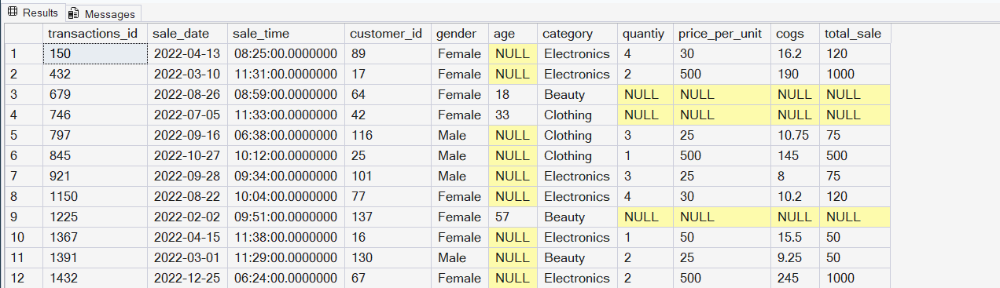
 
5. Check if all columns have NULL 
<b>select * from dbo.retail_sales WHERE transactions_id IS NULL AND sale_date IS NULL AND sale_time IS NULL AND customer_id IS NULL AND gender IS NULL AND 
age IS NULL AND category IS NULL AND quantity IS NULL AND price_per_unit IS NULL AND cogs IS NULL AND total_sale IS NULL;</b>
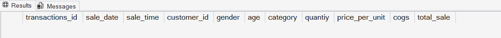
 
6. Find total nulls in each column 
<b>select
COUNT(CASE WHEN age IS NULL THEN 1 END) AS Age_null,
COUNT(CASE WHEN quantity IS NULL THEN 1 END) AS Quantity_null,
COUNT(CASE WHEN price_per_unit IS NULL THEN 1 END) AS price_per_unit_null,
COUNT(CASE WHEN cogs IS NULL THEN 1 END) AS cogs_null,
COUNT(CASE WHEN total_sale IS NULL THEN 1 END) AS totalsale_null
from dbo.retail_sales;</b>
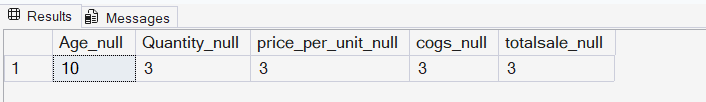
 
7. Find columns that have quantity,price_per_unit,cogs and total_sale all as NULL and remove them 
<b>select * from dbo.retail_sales WHERE quantity IS NULL AND price_per_unit IS NULL AND cogs IS NULL AND total_sale IS NULL; 
delete from dbo.retail_sales WHERE quantity IS NULL AND price_per_unit IS NULL AND cogs IS NULL AND total_sale IS NULL;</b>
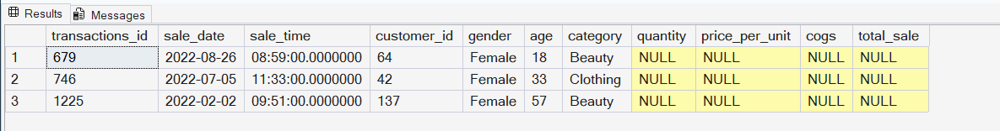
 
8. Replace NULL age with average age 
<b>select * from dbo.retail_sales WHERE age IS NULL; 
update dbo.retail_sales set age = (select AVG(CAST(age AS INT)) from dbo.retail_sales WHERE age IS NOT NULL) WHERE age IS NULL;</b> 

  
9. Update sale time data type from TIME(7) to TIME(0) format 
<b>select sale_time, CAST(sale_time AS TIME(0)) as updated_time from dbo.retail_sales;  
alter table dbo.retail_sales alter column sale_time TIME(0);  
update dbo.retail_sales set sale_time = CAST(sale_time AS TIME(0));  
select sale_time from dbo.retail_sales;</b>
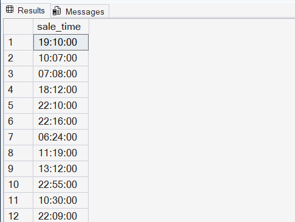

### 3. Data analysis using SQL queries
<ol>
  <li>What were all the sales transactions that occurred on November 5, 2022?</li>
  
select * from dbo.retail_sales WHERE sale_date = '2022-11-05';

  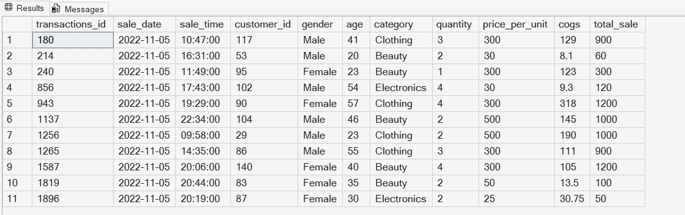
   
  
  <li>Retrieve all transactions where the category is 'Clothing' and the quantity sold is more than 4 in the month of Nov-2022</li>
  
select * from dbo.retail_sales WHERE category = 'Clothing' AND quantity >= 4 AND sale_date BETWEEN '2022-11-01' AND '2022-11-30';

  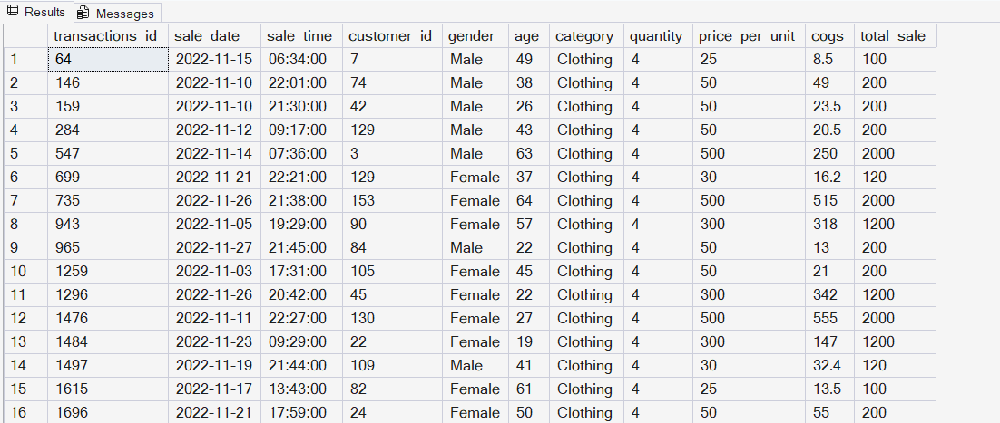
   
  
  <li>Calculate the total sales and total orders for each category</li>
  
select category,SUM(total_sale) as [Total Sales], COUNT(*) as [Total Orders] from dbo.retail_sales
GROUP BY category;

  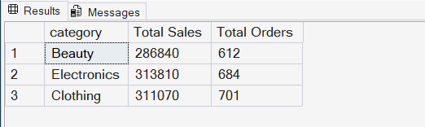
   
  
  <li>Find the average age of customers who purchased items from the 'Beauty' category.</li>
  
select AVG(age) as [Average age] from dbo.retail_sales WHERE category = 'Beauty';

 
  
<li>Find all transactions where the total_sale is greater than 1000</li>
  
select * from dbo.retail_sales WHERE total_sale > 1000;

  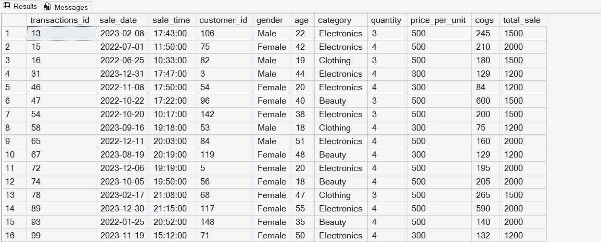
 
  
  <li>Find the total number of transactions (transaction_id) made by each gender in each category.</li>
  
select gender,category, COUNT(transactions_id) as [Total number of Transactions] from dbo.retail_sales
GROUP BY gender,category
ORDER BY gender,category DESC;

  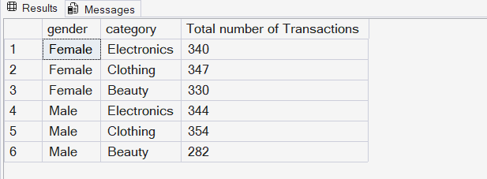
   

  <li>Calculate the average sale for each month. Find out best selling month in each year</li>
  
WITH BestMonth_CTE AS
(
select YEAR(sale_date) as year, DATENAME(MONTH,sale_date) as month, AVG(total_sale) as average_sale, 
DENSE_RANK() OVER(PARTITION BY YEAR(sale_date) ORDER BY AVG(total_sale) DESC) as rank
from dbo.retail_sales
GROUP BY YEAR(sale_date),DATENAME(MONTH,sale_date)
)

select month,year, average_sale from BestMonth_CTE WHERE rank = 1;

 

<li>Find the top 5 customers based on the highest total sales</li>
  
WITH top5_cte AS
(
select customer_id,SUM(total_sale) as total_sales, DENSE_RANK() OVER(ORDER BY SUM(total_sale) DESC) as rank from dbo.retail_sales
GROUP BY customer_id
)
select * from top5_cte where rank<=5

 

<li>Find the number of unique customers who purchased items from each category</li>
  
select category,COUNT(DISTINCT(customer_id)) [Total Unique customers] from dbo.retail_sales
GROUP BY category;

 

<li>Create each shift and number of orders (Example Morning <12, Afternoon Between 12 & 17, Evening >17)</li>
  
select * from dbo.retail_sales

WITH shift_cte AS
(
select *,
CASE
WHEN DATEPART(HOUR,sale_time) < 12 THEN 'Morning'
WHEN DATEPART(HOUR,sale_time) BETWEEN 12 AND 17 THEN 'Afternoon'
ELSE 'Evening'
END as shift
from dbo.retail_sales
)
select shift, COUNT(*) as total_orders from shift_cte
GROUP BY shift;

 

<li>Find the customer who spent the most in each month.</li>

WITH Monthlycustomersale_cte AS
(
select customer_id,SUM(total_sale) as total_sales,DATEPART(YEAR,sale_date) as year,DATEPART(MONTH,sale_date) as month,
DENSE_RANK() OVER(PARTITION BY DATEPART(YEAR,sale_date),DATEPART(MONTH,sale_date) ORDER BY SUM(total_sale) DESC) as rn
from dbo.retail_sales
GROUP BY customer_id,DATEPART(YEAR,sale_date),DATEPART(MONTH,sale_date)
)
select customer_id,total_sales,year,month from Monthlycustomersale_cte WHERE rn=1
ORDER BY year,month;

 

<li>Find the top 3 customers (by total sales) within each product category.</li>

WITH top3cte AS
(
select category,customer_id,SUM(total_sale) AS total_sales,
DENSE_RANK() OVER(PARTITION BY category ORDER BY SUM(total_sale) DESC) AS rank
from dbo.retail_sales
GROUP BY category, customer_id
)
SELECT category, customer_id,total_sales FROM top3cte
WHERE rank <= 3;

 

<li>Find all customers whose total sales are greater than the average total sales across all customers.</li>

WITH customer_cte AS(
select customer_id, SUM(total_sale) as total_sales
from dbo.retail_sales
GROUP BY customer_id
)
select customer_id,total_sales from customer_cte WHERE total_sales > (select AVG(total_sales) from customer_cte)
ORDER BY total_sales DESC;

 

<li>Find the highest-value transaction in each category.</li>

WITH category_cte AS
(
select transactions_id,category,customer_id,total_sale,
ROW_NUMBER() OVER(PARTITION BY category ORDER BY total_sale DESC) as rn from dbo.retail_sales
)
select transactions_id,category,customer_id,total_sale from category_cte WHERE rn=1

 

<li>Find the top 3 highest-value transactions in each category.</li>

with Transaction_cte AS(
select transactions_id, customer_id, category,total_sale, 
ROW_NUMBER() OVER(PARTITION BY category ORDER BY total_sale DESC) as rn from dbo.retail_sales)
select * from Transaction_cte WHERE rn<=3;

</ol>

## 💡 Insights
★ **Electronics** generated the highest **total sales revenue**, while **Clothing** recorded the highest **number of orders**.

★ Customers purchasing **Beauty** products had an average age of **40 years**.

★ **Clothing** was the most popular category among both **male** and **female** customers, followed by **Electronics** and **Beauty**.

★ **July 2022** was the best-selling month of 2022, with an average sales value of **₹541.34**. In **2023**, **February** was the best-selling month, with an average sales value of **₹535.53**.

★ The **top five customers** by total sales were **Customer IDs 3, 1, 5, 2, and 4**.

★ **Clothing** attracted the highest number of unique customers (**149**), followed by **Electronics (144)** and **Beauty (141)**.

★ The **Evening shift (after 5:00 PM)** recorded the highest order volume with **1,062 orders**, followed by the **Morning** and **Afternoon** shifts.

★ **Top-performing customers by category**
- **Beauty:** Customer IDs **1, 3, 4**
- **Clothing:** Customer IDs **5, 1, 3**
- **Electronics:** Customer IDs **3, 5, 2**

★ **Highest-value transactions by category**
- **Beauty:** Transaction ID **74**
- **Clothing:** Transaction ID **269**
- **Electronics:** Transaction ID **152**

★ **Top three highest-value transactions by category**
- **Beauty:** Transaction IDs **74, 93, 139**
- **Clothing:** Transaction IDs **269, 253, 166**
- **Electronics:** Transaction IDs **152, 155, 157**

 

If you found this project helpful, consider giving it a ⭐ on GitHub!  Thank you❤️

  <h2>Connect with Me</h2>

 
